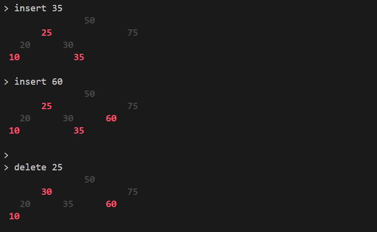

# rbtree-cli
  
A red black tree implementation with simple commandline interaction supported 

## Development Tasks

- [x]  Chose testing framework (Jest vs Mocha, etc)
- [x]  Find a good page documenting rules
- [x]  Setup project structure and Git
- [x]  Determine what functions to support (find, size, flatten, etc)
- [x]  Implement function stubs & tests
    - [x] Insert works
    - [x] Delete works
    - [x] Find works
    - [x] Duplicate insertion
    - [x] Deletion of a non-existant element
    - [x] Test functions on null root
    - [x] Left rotation works
    - [x] Right rotation works
    - [x] Approriate colour adjustments after rotation
    - [x] Check properties (black root, black leaves, red node = black parent, all paths to leaves contain same black node count, max height 2log2(n+1))
    - [x] Insert maintains red black tree properties 
    - [x] Delete maintains red black tree properties
- [x]  Implement functions
    - [x] Insert
    - [x] Delete
    - [x] Find
    - [x] Size
    - [x] Depth    
    - [x] Collapse

## Testing

We are going with Jest here as it is a more wholistic testing suite. Mocha is also good but requires us to find separate assertion libraries and whatnot. Jest is also built into React, so learning this testing framework will help when I move into learning React. 

## Rules/Pseudocode
Following sources used:
- Introduction to Algorithms 3rd Edition (Pg 308 - 339) by Clifford Stein, Thomas H. Cormen, Charles E. Leiserson, Ronald L. Rivest
- [Red-Black Tree | Brilliant Math & Science Wiki](https://brilliant.org/wiki/red-black-tree/)

### Rules
1. Root node is always black
2. The null leaf nodes are always black
3. Red nodes must have 2 black childeren (thus red nodes cannot have red parents)
4. For any node in the tree, all paths to the leaves contain the same number of black nodes (have the same "black depth")

## Supported Functionality
- Insert
- Delete
- Find
- Size (how many nodes?)
- Depth (how many levels? (includes leaves))
- Collapse (root first)